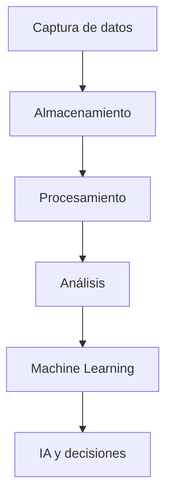

# 📊 Práctica RA5 · c+d — Big Data e IA

## 1) Caso
- **Sistema:** Plataforma de comercio electrónico inteligente  
- **Contexto:** Empresa de venta online que analiza el comportamiento de los clientes para recomendar productos y mejorar las ventas.

---

## 2) Conceptos

- **Big Data:**  
  Conjunto de tecnologías y procesos para almacenar y gestionar grandes cantidades de datos.

- **Análisis de datos:**  
  Proceso de examinar datos para obtener información útil y detectar patrones.

- **Machine Learning:**  
  Rama de la IA que permite a los sistemas aprender automáticamente a partir de datos.

- **Deep Learning:**  
  Subárea del Machine Learning basada en redes neuronales profundas.

- **IA (Inteligencia Artificial):**  
  Tecnología capaz de simular procesos de inteligencia humana como aprender o tomar decisiones.

---

## 3) Relación

- Big Data proporciona grandes cantidades de datos.
- El análisis de datos transforma esos datos en información útil.
- Machine Learning utiliza los datos para aprender patrones.
- Deep Learning mejora el aprendizaje en tareas complejas.
- La IA aplica todo esto para automatizar decisiones y procesos.

---

## 4) Pipeline

1. Captura de datos  
2. Almacenamiento  
3. Procesamiento  
4. Análisis  
5. Entrenamiento del modelo IA  
6. Predicción o recomendación  
7. Toma de decisiones  

---

## 5) 5V del Big Data

- **Volumen:**  
  Grandes cantidades de datos de clientes y productos.

- **Velocidad:**  
  Datos generados en tiempo real durante las compras.

- **Variedad:**  
  Datos estructurados y no estructurados (texto, imágenes, clics).

- **Veracidad:**  
  Calidad y fiabilidad de los datos recopilados.

- **Valor:**  
  Información útil para aumentar ventas y mejorar servicios.

---

## 6) Ejemplo aplicado

- **Datos:**  
  Historial de compras y búsquedas de clientes.

- **Análisis:**  
  Identificación de productos más visitados.

- **Modelo:**  
  Sistema de recomendación basado en Machine Learning.

- **Decisión:**  
  Mostrar productos personalizados a cada usuario.

---

## 7) Tabla

| Concepto | Función |
|---|---|
| Big Data | Gestionar grandes cantidades de datos |
| Análisis de datos | Obtener información útil |
| Machine Learning | Aprender patrones automáticamente |
| Deep Learning | Resolver tareas complejas mediante redes neuronales |
| IA | Automatizar decisiones inteligentes |

---

## 8) Diagrama

---

## 9) Problemas

| Problema | Solución |
|---|---|
| Gran cantidad de datos desordenados | Uso de bases de datos Big Data y limpieza de datos |
| Predicciones incorrectas del modelo | Reentrenamiento y mejora del algoritmo |

---

## 10) Fuente

| Recurso | Enlace |
|---|---|
| IBM Big Data | https://www.ibm.com/topics/big-data |
| Google AI | https://ai.google |
| Microsoft IA | https://www.microsoft.com/ai |
