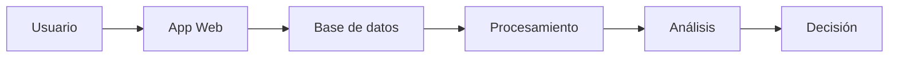

# Práctica RA5 · a+b — Datos e información

---

## 1) Caso

- **Sistema:** Tienda online (e-commerce)  
- **Contexto:** Plataforma web donde los usuarios compran productos, navegan por categorías y reciben recomendaciones personalizadas.

---

## 2) Datos

- ID del usuario  
- Producto visitado  
- Tiempo en la página  
- Precio del producto  
- Fecha de compra  
- Método de pago  
- Ubicación del usuario  

---

## 3) Información

- Productos más vendidos de la semana  
- Perfil de compra de cada usuario  
- Horas con más ventas  
- Productos recomendados según intereses  

---

## 4) Diferencia

Un **dato** es un valor bruto sin interpretar (por ejemplo: “usuario X ha visto un producto”).  

La **información** es el resultado de procesar esos datos para obtener significado (por ejemplo: “los usuarios prefieren productos de tecnología por la tarde”).

---

## 5) Ciclo del dato

- **Captura:**  
El usuario navega por la web, hace clics y realiza compras.

- **Almacenamiento:**  
Los datos se guardan en una base de datos.

- **Procesamiento:**  
Se organizan y limpian los datos (filtrado de errores, duplicados, etc.).

- **Análisis:**  
Se estudian patrones de comportamiento (qué productos se venden más, cuándo, etc.).

- **Uso:**  
Se generan recomendaciones, ofertas personalizadas y decisiones de negocio.

- **Eliminación:**  
Los datos antiguos o innecesarios se eliminan o se archivan según normativa.

---

## 6) Aplicación

- **Decisiones:**
  - Qué productos destacar en la web  
  - Qué ofertas lanzar  
  - Cómo personalizar la experiencia del usuario  

- **Valor:**
Transformar datos en información permite mejorar las ventas, entender a los clientes y tomar decisiones estratégicas basadas en hechos.

---

## 7) Tabla

| Dato | Información |
|------|-------------|
| Usuario visita producto X | Producto X es popular |
| Compra realizada a las 20:00 | Hora punta de ventas |
| Usuario compra tecnología | Preferencia por productos tecnológicos |
| Tiempo alto en una página | Producto genera interés |
| Muchos clics sin compra | Problema en el proceso de compra |

---

## 8) Diagrama

---

## 9) Problemas

- **Problema 1:** Datos incorrectos o duplicados  
- **Solución 1:** Validación y limpieza de datos  

- **Problema 2:** Datos incompletos  
- **Solución 2:** Formularios obligatorios y verificación automática  

---

## 10) Fuente

- **Enlace:**  
https://www.ibm.com/topics/data-analytics
